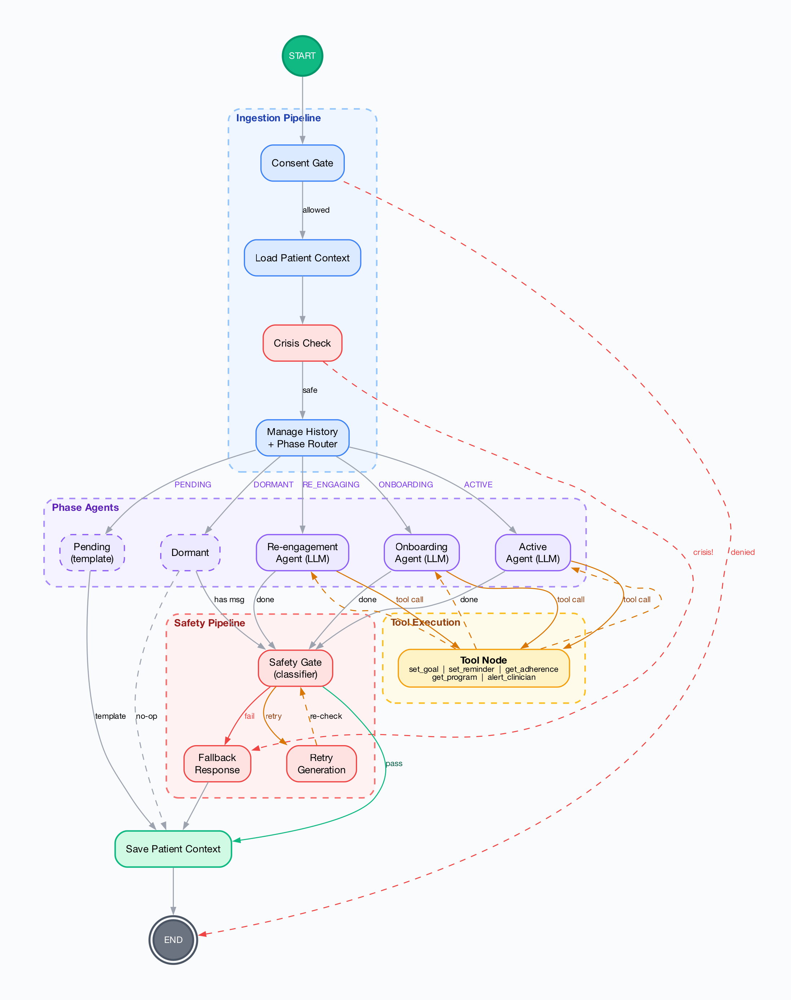

# Health Ally

AI-powered exercise accountability partner for MedBridge Go patients. Guides patients through onboarding, goal-setting, and scheduled follow-ups via multi-turn conversations — while enforcing strict clinical safety boundaries.


## Quick Start

**Prerequisites:** Python 3.12+, [uv](https://docs.astral.sh/uv/), PostgreSQL 16+ (or SQLite for local dev)

```bash
uv sync
cp .env.example .env       # set ANTHROPIC_API_KEY at minimum
uv run alembic upgrade head # run migrations
uv run python -m health_ally
```

The service starts at `http://localhost:8000` with SQLite by default. Set `DATABASE_URL` for PostgreSQL.

### Docker

```bash
docker compose up          # local dev with PostgreSQL
docker build -t health-ally .
```

### Run Modes

```bash
uv run python -m health_ally --mode api      # HTTP API only
uv run python -m health_ally --mode worker   # background workers only
uv run python -m health_ally --mode all      # both (default)
```

## Development

```bash
pytest                                       # unit tests
pytest --cov                                 # with coverage
ruff check . && ruff format --check .        # lint + format
pyright .                                    # type check
pytest tests/evals/                          # LLM evals (requires ANTHROPIC_API_KEY)
```

## Architecture

**Core principle:** deterministic policy in Python, bounded generation by LLM. Application code controls phase transitions, safety gates, and consent enforcement. The LLM handles conversation within a phase — it is never trusted with state transitions or safety-critical routing.



Patient lifecycle phases are managed by application code only:

```
PENDING → ONBOARDING → ACTIVE → RE_ENGAGING → DORMANT
                          ↑                       │
                          └───────────────────────┘
```

## API

| Endpoint | Method | Description |
|---|---|---|
| `/v1/chat` | POST | Send a message (SSE streaming) |
| `/webhooks/medbridge` | POST | MedBridge events (HMAC verified) |
| `/v1/patients/{id}/phase` | GET | Current patient phase |
| `/v1/patients/{id}/goals` | GET | Patient goals |
| `/v1/patients/{id}/alerts` | GET | Clinician alerts |
| `/health/live` | GET | Liveness probe |
| `/health/ready` | GET | Readiness probe |

Full schema: [`docs/openapi.json`](docs/openapi.json)

## Configuration

See [`src/health_ally/settings.py`](src/health_ally/settings.py) for all available environment variables. Key variables:

| Variable | Default | Description |
|---|---|---|
| `DATABASE_URL` | `sqlite+aiosqlite:///./health_ally.db` | Database connection |
| `ANTHROPIC_API_KEY` | — | Required for LLM calls |
| `ENVIRONMENT` | `dev` | `dev` / `staging` / `prod` |
| `DEFAULT_MODEL` | `claude-sonnet-4-6` | Primary LLM model |

## Documentation

| Document | Description |
|---|---|
| [Product Overview](docs/product-overview.md) | Problem statement, users, and design principles |
| [Architecture Decisions](docs/decisions.md) | Append-only ADR log |
| [Intended Use & Safety](docs/intended-use.md) | Clinical boundaries and safety architecture |
| [PHI Data Flow](docs/phi-data-flow.md) | HIPAA compliance and data handling |
| [Release Runbook](docs/release-runbook.md) | Deployment, rollback, and monitoring |
| [Requirements](docs/requirements.md) | Functional requirements |